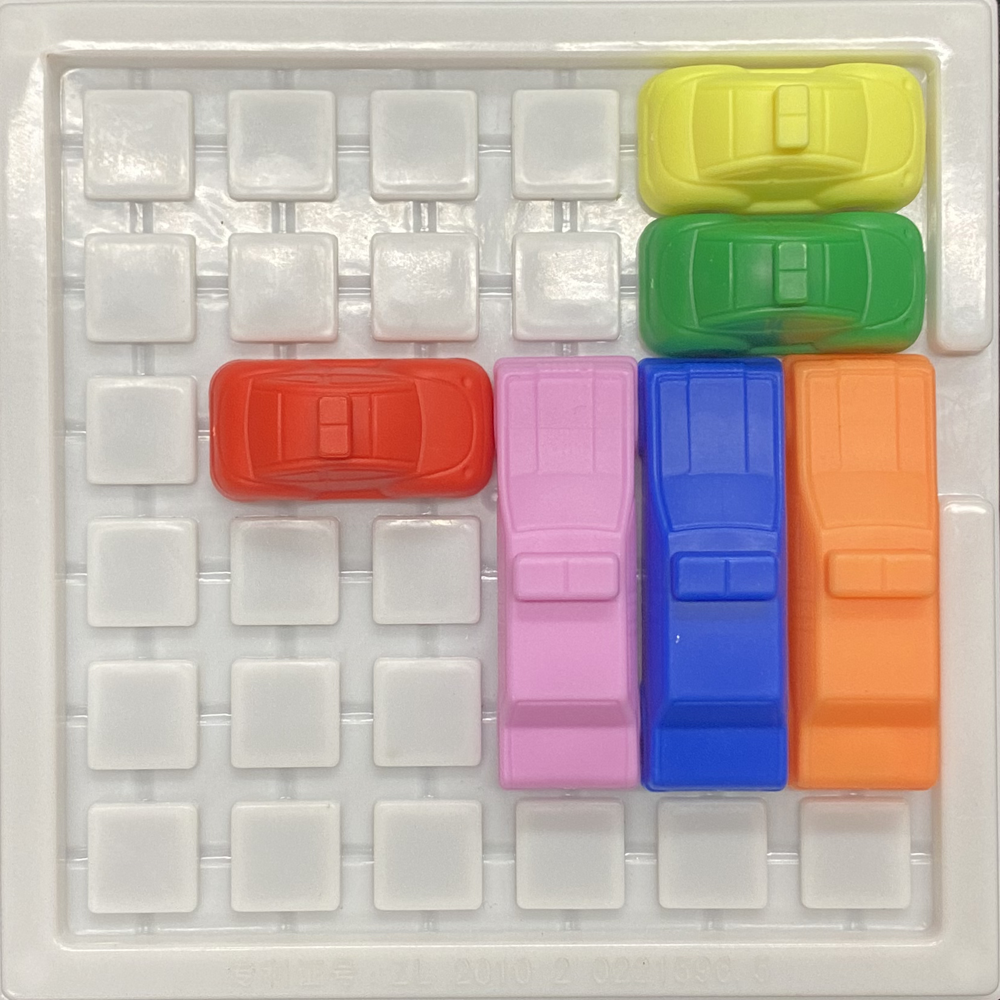

# IqCar

By Casey Ford, Alex Peseckis, Jack Stanek

## Introduction

### What is IQ Car?

IQ Car is a knockoff of the more well-known board game Rush Hour. The goal of the game is to move a goal car off of the game board while only moving it forward or backward. The challenge of the game comes from the fact that there are typically other cars in the way of the goal car who also can only be moved forward and backward and who can block the goal car from exiting the game board. This causes the game to be like a puzzle where only a specific sequence of moves using a specific sequence of cars will allow the goal car to be moved off of the gameboard.

### Example and Problem Statement

In the above example game board, the goal is to move the red car to the right and off the game board through the slot in the game board's wall. The issue is that multiple cars lie in its path and must be moved out of the way before the it can reach the slot. While this may be a simple example of the game, much more difficult setups can be imagined in which the average person may have great difficulty solving the board. Even worse, they may become stuck and want the solution for future reference but not know anyone good enough at the game to solve it for them. Our project empowers users to overcome such situations by allowing them to upload a photo of their game board and have it solved for them by the computer.

## Methodology

## Results

